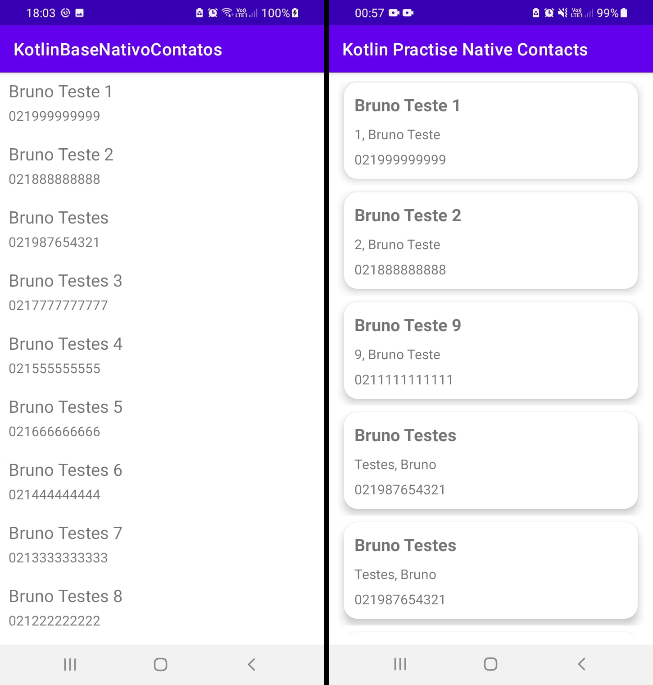

# Kotlin Practise Native Contacts

- Instrutor: Daniel Richter
- Plataforma de Ensino: https://digitalinnovation.one/sign-up?ref=K5EF2VCVKA
- Módulo Utilizando Recursos Nativos do Android (Contatos)

	

## Vídeo Explicativo

  [Youtube](https://youtu.be/vXnq35P3aDA)

##  Objetivo

- Aplicação destinada à prática do módulo Utilizando Recursos Nativos do Android (Contatos).
- Melhoria com a refatoração do código com uso de viewBinding
- Melhoria no layout com uso de componentes do Material
- Adição de evento de click no item da lista, com exibição de uma Tost

## Tecnologias Utilizadas

- Kotlin
- TypeScript
- viewBinding
- Permission
- contentResolver
- ContactsContract

## Conteúdo apresentado

- Organização do provedor de contatos
- Relacionamento das tabelas principais
- Fluxo de dados entre provedores de contatos
- Interagindo com os contatos

## Desafio proposto

- Atualizar o código para mostrar abaixo do nome o DISPLAY_NAME_ALTERNATIVE,
de forma a exibir na aplicação criada 03 dados dos contatos

## Autor

- Bruno Gamba Rocha
- https://www.linkedin.com/in/bruno-gamba-rocha/